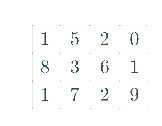

# What is Numpy?

NumPy is the fundamental package for scientific computing in Python. It is a Python library that provides a multidimensional array object, various derived objects (such as masked arrays and matrices), and<b> an assortment of routines for fast operations on arrays, including mathematical, logical, shape manipulation, sorting, selecting, I/O, discrete Fourier transforms, basic linear algebra, basic statistical operations, random simulation and much more.</b>

Array in Numpy is a table of elements (usually numbers), all of the same type, indexed by a tuple of positive integers. In Numpy, number of dimensions of the array is called rank of the array. A tuple of integers giving the size of the array along each dimension is known as shape of the array. An array class in Numpy is called as ndarray. Elements in Numpy arrays are accessed by using square brackets and can be initialized by using nested Python Lists.

In computer programming, an array is a structure for storing and retrieving data. We often talk about an array as if it were a grid in space, with each cell storing one element of the data. For instance, if each element of the data were a number, we might visualize a “one-dimensional” array like a list:
                                                     
                                                     

 
A two-dimensional array would be like a table:

 
A three-dimensional array would be like a set of tables, perhaps stacked as though they were printed on separate pages. In NumPy, this idea is generalized to an arbitrary number of dimensions, and so the fundamental array class is called ndarray: it represents an “N-dimensional array”.

Most NumPy arrays have some restrictions. For instance:
- All elements of the array must be of the same type of data.
- Once created, the total size of the array can’t change.
- The shape must be “rectangular”, not “jagged”; e.g., each row of a two-dimensional array must have the same number of columns.

When these conditions are met, NumPy exploits these characteristics to make the array faster, more memory efficient, and more convenient to use than less restrictive data structures.
For the remainder of this document, we will use the word “array” to refer to an instance of ndarray.

# Creating Arrays in Numpy

Arrays in Numpy can be created by multiple ways, with various number of Ranks, defining the size of the Array. Arrays can also be created with the use of various data types such as lists, tuples, etc. The type of the resultant array is deduced from the type of the elements in the sequences.

You can check the array creation examples here:  
[➡️ numpyArrayCreations.py](./numpyArrayCreations.py)

# List of All Numpy Functions
<table>
  <tr>
    <td><a href="https://numpy.org/doc/stable/search.html?q=all" target="_blank">all()</a></td>
    <td><a href="https://numpy.org/doc/stable/search.html?q=diag" target="_blank">diag()</a></td>
    <td><a href="https://numpy.org/doc/stable/search.html?q=hypot" target="_blank">hypot()</a></td>
    <td><a href="https://numpy.org/doc/stable/search.html?q=ones_like" target="_blank">ones_like()</a></td>
  </tr>
  <tr>
    <td><a href="https://numpy.org/doc/stable/search.html?q=any" target="_blank">any()</a></td>
    <td><a href="https://numpy.org/doc/stable/search.html?q=diagflat" target="_blank">diagflat()</a></td>
    <td><a href="https://numpy.org/doc/stable/search.html?q=absolute" target="_blank">absolute()</a></td>
    <td><a href="https://numpy.org/doc/stable/search.html?q=full_like" target="_blank">full_like()</a></td>
  </tr>
  <tr>
    <td><a href="https://numpy.org/doc/stable/search.html?q=take" target="_blank">take()</a></td>
    <td><a href="https://numpy.org/doc/stable/search.html?q=diag_indices" target="_blank">diag_indices()</a></td>
    <td><a href="https://numpy.org/doc/stable/search.html?q=ceil" target="_blank">ceil()</a></td>
    <td><a href="https://numpy.org/doc/stable/search.html?q=sin" target="_blank">sin()</a></td>
  </tr>
  <tr>
    <td><a href="https://numpy.org/doc/stable/search.html?q=argmax" target="_blank">argmax()</a></td>
    <td><a href="https://numpy.org/doc/stable/search.html?q=diag_indices_from" target="_blank">diag_indices_from()</a></td>
    <td><a href="https://numpy.org/doc/stable/search.html?q=clip" target="_blank">clip()</a></td>
    <td><a href="https://numpy.org/doc/stable/search.html?q=cos" target="_blank">cos()</a></td>
  </tr>
  <tr>
    <td><a href="https://numpy.org/doc/stable/search.html?q=argmin" target="_blank">argmin()</a></td>
    <td><a href="https://numpy.org/doc/stable/search.html?q=diagonal" target="_blank">diagonal()</a></td>
    <td><a href="https://numpy.org/doc/stable/search.html?q=concatenate" target="_blank">concatenate()</a></td>
    <td><a href="https://numpy.org/doc/stable/search.html?q=tan" target="_blank">tan()</a></td>
  </tr>
  <tr>
    <td><a href="https://numpy.org/doc/stable/search.html?q=argsort" target="_blank">argsort()</a></td>
    <td><a href="https://numpy.org/doc/stable/search.html?q=digitize" target="_blank">digitize()</a></td>
    <td><a href="https://numpy.org/doc/stable/search.html?q=copy" target="_blank">copy()</a></td>
    <td><a href="https://numpy.org/doc/stable/search.html?q=exp" target="_blank">exp()</a></td>
  </tr>
  <tr>
    <td><a href="https://numpy.org/doc/stable/search.html?q=around" target="_blank">around()</a></td>
    <td><a href="https://numpy.org/doc/stable/search.html?q=dot" target="_blank">dot()</a></td>
    <td><a href="https://numpy.org/doc/stable/search.html?q=cosh" target="_blank">cosh()</a></td>
    <td><a href="https://numpy.org/doc/stable/search.html?q=arccos" target="_blank">arccos()</a></td>
  </tr>
  <tr>
    <td><a href="https://numpy.org/doc/stable/search.html?q=arcsin" target="_blank">arcsin()</a></td>
    <td><a href="https://numpy.org/doc/stable/search.html?q=arctan" target="_blank">arctan()</a></td>
    <td><a href="https://numpy.org/doc/stable/search.html?q=arctan2" target="_blank">arctan2()</a></td>
    <td><a href="https://numpy.org/doc/stable/search.html?q=bitwise_and" target="_blank">bitwise_and()</a></td>
  </tr>
  <tr>
    <td><a href="https://numpy.org/doc/stable/search.html?q=bitwise_or" target="_blank">bitwise_or()</a></td>
    <td><a href="https://numpy.org/doc/stable/search.html?q=bitwise_xor" target="_blank">bitwise_xor()</a></td>
    <td><a href="https://numpy.org/doc/stable/search.html?q=bitwise_not" target="_blank">bitwise_not()</a></td>
    <td><a href="https://numpy.org/doc/stable/search.html?q=broadcast_to" target="_blank">broadcast_to()</a></td>
  </tr>
  <tr>
    <td><a href="https://numpy.org/doc/stable/search.html?q=clip" target="_blank">clip()</a></td>
    <td><a href="https://numpy.org/doc/stable/search.html?q=compress" target="_blank">compress()</a></td>
    <td><a href="https://numpy.org/doc/stable/search.html?q=copyto" target="_blank">copyto()</a></td>
    <td><a href="https://numpy.org/doc/stable/search.html?q=cross" target="_blank">cross()</a></td>
  </tr>
  <tr>
    <td><a href="https://numpy.org/doc/stable/search.html?q=cumsum" target="_blank">cumsum()</a></td>
    <td><a href="https://numpy.org/doc/stable/search.html?q=cumprod" target="_blank">cumprod()</a></td>
    <td><a href="https://numpy.org/doc/stable/search.html?q=divmod" target="_blank">divmod()</a></td>
    <td><a href="https://numpy.org/doc/stable/search.html?q=einsum" target="_blank">einsum()</a></td>
  </tr>
  <tr>
    <td><a href="https://numpy.org/doc/stable/search.html?q=empty_like" target="_blank">empty_like()</a></td>
    <td><a href="https://numpy.org/doc/stable/search.html?q=equal" target="_blank">equal()</a></td>
    <td><a href="https://numpy.org/doc/stable/search.html?q=errstate" target="_blank">errstate()</a></td>
    <td><a href="https://numpy.org/doc/stable/search.html?q=exp2" target="_blank">exp2()</a></td>
  </tr>
  <tr>
    <td><a href="https://numpy.org/doc/stable/search.html?q=expm1" target="_blank">expm1()</a></td>
    <td><a href="https://numpy.org/doc/stable/search.html?q=flatnonzero" target="_blank">flatnonzero()</a></td>
    <td><a href="https://numpy.org/doc/stable/search.html?q=fmax" target="_blank">fmax()</a></td>
    <td><a href="https://numpy.org/doc/stable/search.html?q=fmin" target="_blank">fmin()</a></td>
  </tr>
  <tr>
    <td><a href="https://numpy.org/doc/stable/search.html?q=fmod" target="_blank">fmod()</a></td>
    <td><a href="https://numpy.org/doc/stable/search.html?q=frexp" target="_blank">frexp()</a></td>
    <td><a href="https://numpy.org/doc/stable/search.html?q=frombuffer" target="_blank">frombuffer()</a></td>
    <td><a href="https://numpy.org/doc/stable/search.html?q=fromfile" target="_blank">fromfile()</a></td>
  </tr>
  <tr>
    <td><a href="https://numpy.org/doc/stable/search.html?q=fromfunction" target="_blank">fromfunction()</a></td>
    <td><a href="https://numpy.org/doc/stable/search.html?q=fromiter" target="_blank">fromiter()</a></td>
    <td><a href="https://numpy.org/doc/stable/search.html?q=fromstring" target="_blank">fromstring()</a></td>
    <td><a href="https://numpy.org/doc/stable/search.html?q=gradient" target="_blank">gradient()</a></td>
  </tr>
  <tr>
    <td><a href="https://numpy.org/doc/stable/search.html?q=greater" target="_blank">greater()</a></td>
    <td><a href="https://numpy.org/doc/stable/search.html?q=greater_equal" target="_blank">greater_equal()</a></td>
    <td><a href="https://numpy.org/doc/stable/search.html?q=histogram" target="_blank">histogram()</a></td>
    <td><a href="https://numpy.org/doc/stable/search.html?q=histogram2d" target="_blank">histogram2d()</a></td>
  </tr>
  <tr>
    <td><a href="https://numpy.org/doc/stable/search.html?q=histogramdd" target="_blank">histogramdd()</a></td>
    <td><a href="https://numpy.org/doc/stable/search.html?q=hstack" target="_blank">hstack()</a></td>
    <td><a href="https://numpy.org/doc/stable/search.html?q=i0" target="_blank">i0()</a></td>
    <td><a href="https://numpy.org/doc/stable/search.html?q=identity" target="_blank">identity()</a></td>
  </tr>
  <tr>
    <td><a href="https://numpy.org/doc/stable/search.html?q=imag" target="_blank">imag()</a></td>
    <td><a href="https://numpy.org/doc/stable/search.html?q=in1d" target="_blank">in1d()</a></td>
    <td><a href="https://numpy.org/doc/stable/search.html?q=index_exp" target="_blank">index_exp()</a></td>
    <td><a href="https://numpy.org/doc/stable/search.html?q=insert" target="_blank">insert()</a></td>
  </tr>
  <tr>
    <td><a href="https://numpy.org/doc/stable/search.html?q=intersect1d" target="_blank">intersect1d()</a></td>
    <td><a href="https://numpy.org/doc/stable/search.html?q=invert" target="_blank">invert()</a></td>
    <td><a href="https://numpy.org/doc/stable/search.html?q=isclose" target="_blank">isclose()</a></td>
    <td><a href="https://numpy.org/doc/stable/search.html?q=iscomplex" target="_blank">iscomplex()</a></td>
  </tr>
  <tr>
    <td><a href="https://numpy.org/doc/stable/search.html?q=iscomplexobj" target="_blank">iscomplexobj()</a></td>
    <td><a href="https://numpy.org/doc/stable/search.html?q=isfinite" target="_blank">isfinite()</a></td>
    <td><a href="https://numpy.org/doc/stable/search.html?q=isfortran" target="_blank">isfortran()</a></td>
    <td><a href="https://numpy.org/doc/stable/search.html?q=isinf" target="_blank">isinf()</a></td>
  </tr>
  <tr>
    <td><a href="https://numpy.org/doc/stable/search.html?q=isnan" target="_blank">isnan()</a></td>
    <td><a href="https://numpy.org/doc/stable/search.html?q=isneginf" target="_blank">isneginf()</a></td>
    <td><a href="https://numpy.org/doc/stable/search.html?q=isposinf" target="_blank">isposinf()</a></td>
    <td><a href="https://numpy.org/doc/stable/search.html?q=isreal" target="_blank">isreal()</a></td>
  </tr>
  <tr>
    <td><a href="https://numpy.org/doc/stable/search.html?q=isrealobj" target="_blank">isrealobj()</a></td>
    <td><a href="https://numpy.org/doc/stable/search.html?q=issubdtype" target="_blank">issubdtype()</a></td>
    <td><a href="https://numpy.org/doc/stable/search.html?q=issubsctype" target="_blank">issubsctype()</a></td>
    <td><a href="https://numpy.org/doc/stable/search.html?q=itemsize" target="_blank">itemsize()</a></td>
  </tr>
  <tr>
    <td><a href="https://numpy.org/doc/stable/search.html?q=kron" target="_blank">kron()</a></td>
    <td><a href="https://numpy.org/doc/stable/search.html?q=lexsort" target="_blank">lexsort()</a></td>
    <td><a href="https://numpy.org/doc/stable/search.html?q=linalg" target="_blank">linalg</a></td>
    <td><a href="https://numpy.org/doc/stable/search.html?q=linspace" target="_blank">linspace()</a></td>
  </tr>
  <tr>
    <td><a href="https://numpy.org/doc/stable/search.html?q=log" target="_blank">log()</a></td>
    <td><a href="https://numpy.org/doc/stable/search.html?q=log10" target="_blank">log10()</a></td>
    <td><a href="https://numpy.org/doc/stable/search.html?q=log1p" target="_blank">log1p()</a></td>
    <td><a href="https://numpy.org/doc/stable/search.html?q=logical_and" target="_blank">logical_and()</a></td>
  </tr>
  <tr>
    <td><a href="https://numpy.org/doc/stable/search.html?q=logical_not" target="_blank">logical_not()</a></td>
    <td><a href="https://numpy.org/doc/stable/search.html?q=logical_or" target="_blank">logical_or()</a></td>
    <td><a href="https://numpy.org/doc/stable/search.html?q=logical_xor" target="_blank">logical_xor()</a></td>
    <td><a href="https://numpy.org/doc/stable/search.html?q=matmul" target="_blank">matmul()</a></td>
  </tr>
  <tr>
    <td><a href="https://numpy.org/doc/stable/search.html?q=max" target="_blank">max()</a></td>
    <td><a href="https://numpy.org/doc/stable/search.html?q=maximum" target="_blank">maximum()</a></td>
    <td><a href="https://numpy.org/doc/stable/search.html?q=min" target="_blank">min()</a></td>
    <td><a href="https://numpy.org/doc/stable/search.html?q=minimum" target="_blank">minimum()</a></td>
  </tr>
  <tr>
    <td><a href="https://numpy.org/doc/stable/search.html?q=mod" target="_blank">mod()</a></td>
    <td><a href="https://numpy.org/doc/stable/search.html?q=modf" target="_blank">modf()</a></td>
    <td><a href="https://numpy.org/doc/stable/search.html?q=moveaxis" target="_blank">moveaxis()</a></td>
    <td><a href="https://numpy.org/doc/stable/search.html?q=nan_to_num" target="_blank">nan_to_num()</a></td>
  </tr>
  <tr>
    <td><a href="https://numpy.org/doc/stable/search.html?q=nancumprod" target="_blank">nancumprod()</a></td>
    <td><a href="https://numpy.org/doc/stable/search.html?q=nancumsum" target="_blank">nancumsum()</a></td>
    <td><a href="https://numpy.org/doc/stable/search.html?q=nanmax" target="_blank">nanmax()</a></td>
    <td><a href="https://numpy.org/doc/stable/search.html?q=nanmean" target="_blank">nanmean()</a></td>
  </tr>
  <tr>
    <td><a href="https://numpy.org/doc/stable/search.html?q=nanmin" target="_blank">nanmin()</a></td>
    <td><a href="https://numpy.org/doc/stable/search.html?q=nanprod" target="_blank">nanprod()</a></td>
    <td><a href="https://numpy.org/doc/stable/search.html?q=nansum" target="_blank">nansum()</a></td>
    <td><a href="https://numpy.org/doc/stable/search.html?q=nanvar" target="_blank">nanvar()</a></td>
  </tr>
  <tr>
    <td><a href="https://numpy.org/doc/stable/search.html?q=newaxis" target="_blank">newaxis</a></td>
    <td><a href="https://numpy.org/doc/stable/search.html?q=nonzero" target="_blank">nonzero()</a></td>
    <td><a href="https://numpy.org/doc/stable/search.html?q=not_equal" target="_blank">not_equal()</a></td>
    <td><a href="https://numpy.org/doc/stable/search.html?q=ndenumerate" target="_blank">ndenumerate()</a></td>
  </tr>
  <tr>
    <td><a href="https://numpy.org/doc/stable/search.html?q=npermutations" target="_blank">npermutations()</a></td>
    <td><a href="https://numpy.org/doc/stable/search.html?q=nprod" target="_blank">nprod()</a></td>
    <td><a href="https://numpy.org/doc/stable/search.html?q=numpy" target="_blank">numpy</a></td>
    <td><a href="https://numpy.org/doc/stable/search.html?q=ones" target="_blank">ones()</a></td>
  </tr>
  <tr>
    <td><a href="https://numpy.org/doc/stable/search.html?q=outer" target="_blank">outer()</a></td>
    <td><a href="https://numpy.org/doc/stable/search.html?q=percentile" target="_blank">percentile()</a></td>
    <td><a href="https://numpy.org/doc/stable/search.html?q=prod" target="_blank">prod()</a></td>
    <td><a href="https://numpy.org/doc/stable/search.html?q=ptp" target="_blank">ptp()</a></td>
  </tr>
  <tr>
    <td><a href="https://numpy.org/doc/stable/search.html?q=put" target="_blank">put()</a></td>
    <td><a href="https://numpy.org/doc/stable/search.html?q=putmask" target="_blank">putmask()</a></td>
    <td><a href="https://numpy.org/doc/stable/search.html?q=rad2deg" target="_blank">rad2deg()</a></td>
    <td><a href="https://numpy.org/doc/stable/search.html?q=ravel" target="_blank">ravel()</a></td>
  </tr>
  <tr>
    <td><a href="https://numpy.org/doc/stable/search.html?q=real" target="_blank">real()</a></td>
    <td><a href="https://numpy.org/doc/stable/search.html?q=remainder" target="_blank">remainder()</a></td>
    <td><a href="https://numpy.org/doc/stable/search.html?q=reshape" target="_blank">reshape()</a></td>
    <td><a href="https://numpy.org/doc/stable/search.html?q=respace" target="_blank">respace()</a></td>
  </tr>
  <tr>
    <td><a href="https://numpy.org/doc/stable/search.html?q=round_" target="_blank">round_()</a></td>
    <td><a href="https://numpy.org/doc/stable/search.html?q=setdiff1d" target="_blank">setdiff1d()</a></td>
    <td><a href="https://numpy.org/doc/stable/search.html?q=sign" target="_blank">sign()</a></td>
    <td><a href="https://numpy.org/doc/stable/search.html?q=sin" target="_blank">sin()</a></td>
  </tr>
  <tr>
    <td><a href="https://numpy.org/doc/stable/search.html?q=sqrt" target="_blank">sqrt()</a></td>
    <td><a href="https://numpy.org/doc/stable/search.html?q=sum" target="_blank">sum()</a></td>
    <td><a href="https://numpy.org/doc/stable/search.html?q=take" target="_blank">take()</a></td>
    <td><a href="https://numpy.org/doc/stable/search.html?q=tan" target="_blank">tan()</a></td>
  </tr>
  <tr>
    <td><a href="https://numpy.org/doc/stable/search.html?q=tile" target="_blank">tile()</a></td>
    <td><a href="https://numpy.org/doc/stable/search.html?q=trace" target="_blank">trace()</a></td>
    <td><a href="https://numpy.org/doc/stable/search.html?q=transpose" target="_blank">transpose()</a></td>
    <td><a href="https://numpy.org/doc/stable/search.html?q=tril" target="_blank">tril()</a></td>
  </tr>
  <tr>
    <td><a href="https://numpy.org/doc/stable/search.html?q=triu" target="_blank">triu()</a></td>
    <td><a href="https://numpy.org/doc/stable/search.html?q=unique" target="_blank">unique()</a></td>
    <td><a href="https://numpy.org/doc/stable/search.html?q=unwrap" target="_blank">unwrap()</a></td>
    <td><a href="https://numpy.org/doc/stable/search.html?q=var" target="_blank">var()</a></td>
  </tr>
  <tr>
    <td><a href="https://numpy.org/doc/stable/search.html?q=vstack" target="_blank">vstack()</a></td>
    <td><a href="https://numpy.org/doc/stable/search.html?q=where" target="_blank">where()</a></td>
    <td><a href="https://numpy.org/doc/stable/search.html?q=zeros" target="_blank">zeros()</a></td>
    <td><a href="https://numpy.org/doc/stable/search.html?q=zeros_like" target="_blank">zeros_like()</a></td>
  </tr>
</table>
